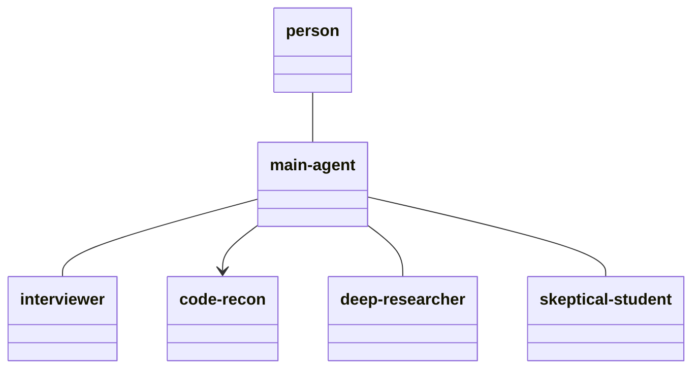
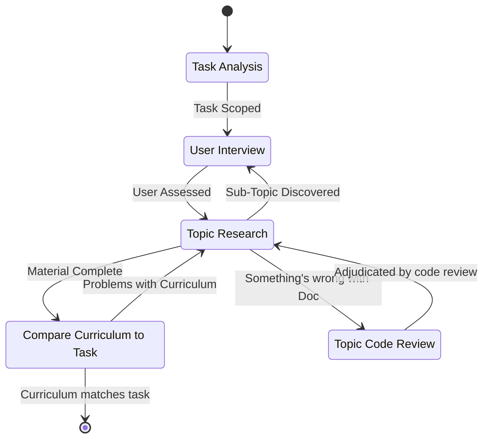

# Overall

This is a command to establish a learning plan to bridge the gap from what they know to what they don't

# The Process

The following Class diagram shows how each of the agents relate. Lines without arrows represent a persistent relationship — the same agent instance stays addressable across multiple rounds, the way a person has an ongoing conversation with the main agent rather than a single exchange. Lines with a directional arrow indicate a one-shot subagent: the main agent spawns it, it completes a single task and reports its findings back, and that instance is not addressed again.

The process is diagrammed here in the following state chart:

When delegating a state to an agent, that state's description text from this document must be included verbatim in the agent's prompt. This applies to the state's own definition only — data produced by other states (research material, prior findings, code excerpts) may still be summarized or excerpted as needed.

Each of the states and transitions is discussed below

## Task Analysis

The AI will establish what the user is trying to achieve. It might be something like:

- Being able to understand a codebase.
- Fixing a bug in an existing codebase.
- Building a new application from scratch.
- Learning a new software tool.

The user will form their request as a prompt entered as a parameter to this command. If the user doesn't provide a prompt, ask them what they're looking to do.

**First, determine the mode:**

- If the user references existing code (a repo, a file path, a specific bug, "help me understand/fix X"), this is **Discovery Mode**. Invoke the `discover-stack` skill.
- If the user describes a goal with no existing code ("I want to build X"), this is **Proposal Mode**. Invoke the `propose-stack` skill.
- If the request is ambiguous, ask the user directly which situation applies before proceeding.

Both skills produce the same output: a **Tech Stack List**, the set of subjects, concepts, Topics, and tools (subject/concept/topic/tools) that make up the system, i.e. everything someone would need to know in order to work on it. 

Any code snippet used in an interview question must be copied verbatim from Task Analysis's findings. Never reconstruct a snippet from memory of what such code typically looks like, even when the reconstruction seems obviously equivalent — an unverified 'typical' example is a fabrication, not a simplification.

Output: Tech Stack List

## User Interview

It's time to see how well the user knows the subject/concept/topic/tool stack. At this point, the user is interviewed to determine their knowledge of the various subjects/concepts/topics/tools. The interview shall be conducted by the `interviewer` agent, invoked iteratively: one question per call, with the AI relaying that question to the user, then relaying the user's answer back to that same agent instance before requesting the next question. The AI does not choose what to ask, interpret an answer, or decide when the interview ends — that authority belongs to the `interviewer` agent alone, which also produces the final determination itself, from having tracked the interview throughout, rather than the AI reconstructing it afterward.

Output: List of what the user knows about each component of the tech stack and what they don't.

## Topic Research

The AI then goes out and does research on each subject/concept/topic/tool and forms a useful curriculum for the user. The research process will use the `deep-researcher` agent and consist of at least the following

- Reading the online documentation on the component. 
- Reading the Forums or articles on the component. 
- Reading source code for the component, if available.  

The research process will likely be recursive. eg: in order to know PostGres, you need to know SQL.  So the AI can stop the research once they've reached something the user knows.

It may be possible that the *Topic Research* process discovers further prerequisites to a given subject/concept/topic/tool.  If this happens, it may be necessary to go back to the *User Interview* and ask more questions to the user. This loop-back must resume the same `interviewer` agent instance used for the original interview, not spawn a new one — the agent needs the full history of prior answers to fold the new question into one coherent determination, rather than producing a second, disconnected assessment.

Output: List of all the pertinent documentation to the tech stack, relative to the user's knowledge base, in the order that they should learn it. 

## Compare Curriculum to Task

The curriculum is then compared to the user's potential experience. This is performed by the `skeptical-student` agent. The task is to compare all of the documentation in the list to the task at hand. Look through every piece of documentation, and figure out whether it is truly sufficient and applicable to the user's learning plan. Like `code-reader`, this agent has no shell or git access — if verifying sufficiency requires checking the user's own project source, that source must already be materialized as plain, readable files (see *Topic Code Review*) before this agent is invoked.
 

Output: The curriculum for the user to follow. 

## Topic Code Review

The *Topic Research* may find what the documentation says simply does not align with a piece of documentation, or that there are different docs out there that don't agree. In this case, we must look at the source code for whatever subject/concept/topic/tool is in question to determine the truth. This state also covers the more common case for an existing-codebase task: any claim made anywhere in this pipeline about the user's own project — in the Tech Stack List, in an interview question, in the research findings — must be verified against that project's actual source before the curriculum treats it as fact, regardless of whether Topic Research flagged it as uncertain. A confidently stated claim is not evidence it was checked.

In order to do this, first materialize the real source as plain files somewhere the agent can read them directly — for a third-party subject/concept/topic/tool, clone its repository to the home directory; for the user's own project, check out the correct branch into a worktree, since a mid-branch git ref is not something these agents can resolve themselves. Then have the `code-reader` agent read through it. Neither `code-reader` nor the `skeptical-student` agent used in *Compare Curriculum to Task* has shell or git access — both can only read files placed directly in front of them. Any state that needs either agent to check real source must complete this preparation first; neither agent can be told to "check the repo" and be expected to locate or check it out on its own.

This state is not limited to resolving items Topic Research explicitly flagged as uncertain. It must also spot-check any code claim baked into the User Interview questions or Topic Research findings against the actual source, regardless of whether anyone flagged it — a confidently stated claim is not evidence it was verified.