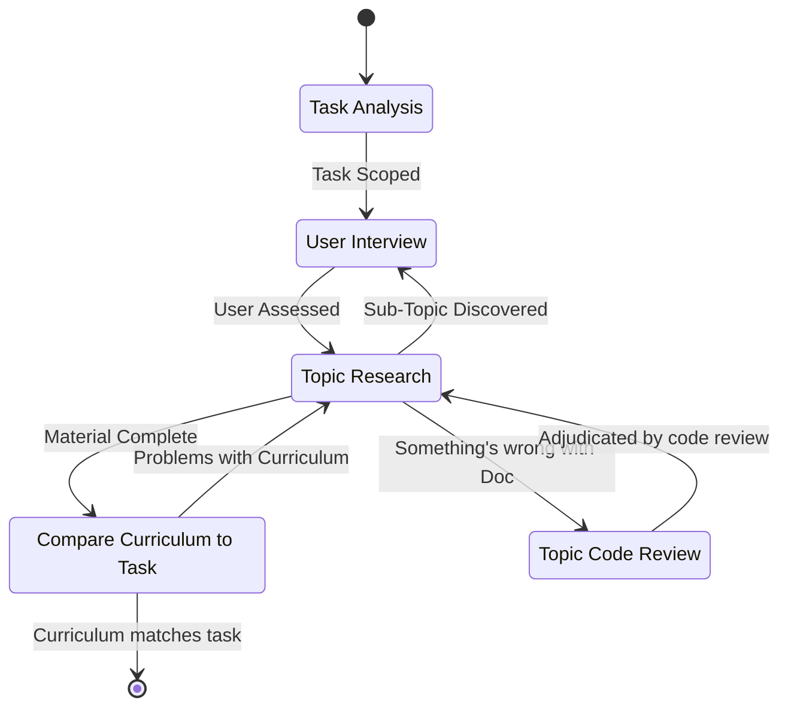

# Overall

This is a command to establish a learning plan to bridge the gap from what they know to what they don't

# The Process

The process is diagrammed here in the following state chart:

Each of the Steps and transitions is discussed Below

## Task Analysis

The AI will establish what the user is trying to achieve. It might be something like:

- Being able to understand a codebase.
- Fixing a bug in an existing codebase.
- Building a new application from scratch.
- Learning a new software tool.

The user will form their request as a prompt entered as a parameter to this command. If the user doesn't provide a prompt, ask them what they're looking to do.

**First, determine the mode:**

- If the user references existing code (a repo, a file path, a specific bug, "help me understand/fix X"), this is **Discovery Mode**. Invoke the `discover-stack` skill.
- If the user describes a goal with no existing code ("I want to build X"), this is **Proposal Mode**. Invoke the `propose-stack` skill.
- If the request is ambiguous, ask the user directly which situation applies before proceeding.

Both skills produce the same output: a **Tech Stack List**, the set of subjects, concepts, Topics, and tools (SCTTs) that make up the system, i.e. everything someone would need to know in order to work on it. 

Output: Tech Stack List

## User Interview

It's time to see how well the user knows the SCTT stack.  At this point, the AI, using the `interviewer` agent, should ask the user questions that determine how well the user knows that component.

Output: List of what the user knows about each component of the tech stack and what they don't.

## Topic Research

The AI then goes out and does research on each SCTT and forms a useful curriculum for the user. The research process will use the `researcher` agent and consist of at least the following

- Reading the online documentation on the component. 
- Reading the Forums or articles on the component. 
- Reading source code for the component, if available.  

The research process will likely be recursive. eg: in order to know PostGres, you need to know SQL.  So the AI can stop the research once they've reached something the user knows.

It may be possible that the *Topic Research* process discovers further prerequisites to a given SCTT.  If this happens, it may be necessary to go back to the *User Interview* and ask more questions to the user. 

Output: List of all the pertinent documentation to the tech stack, relative to the user's knowledge base, in the order that they should learn it. 

## Compare Curriculum to Task

The curriculum is then compared to the user's potential experience. This is performed by the `skeptical-student` agent.  The task is to compare all of the documentation in the list to the task at hand. Look through every piece of documentation, and figure out whether it is truly sufficient and applicable to the user's learning plan.  

Output: The curriculum for the user to follow. 

## Topic Code Review

The *Topic Research* may find what the documentation says simply does not align with a piece of docuemntation, or that there are different docs out there that don't agree.  In this case, we must look at the source code for whatever SCTT is in question to determine the truth. 

During this phase, the documentation must be directly compared to the source code for the SCTT.  This determines which documentation is right about what actually happens.  

If the *Topic Code Review* yields problems, it will send those problems back to the *Topic Research* stage for further research to find a better explanation that gets at those problems. 

## Transitions

Most of the Transitions in the state chart are clear, but the ones below have further explanation
