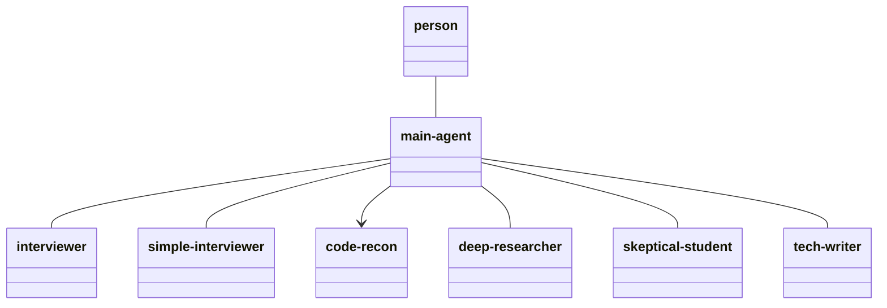
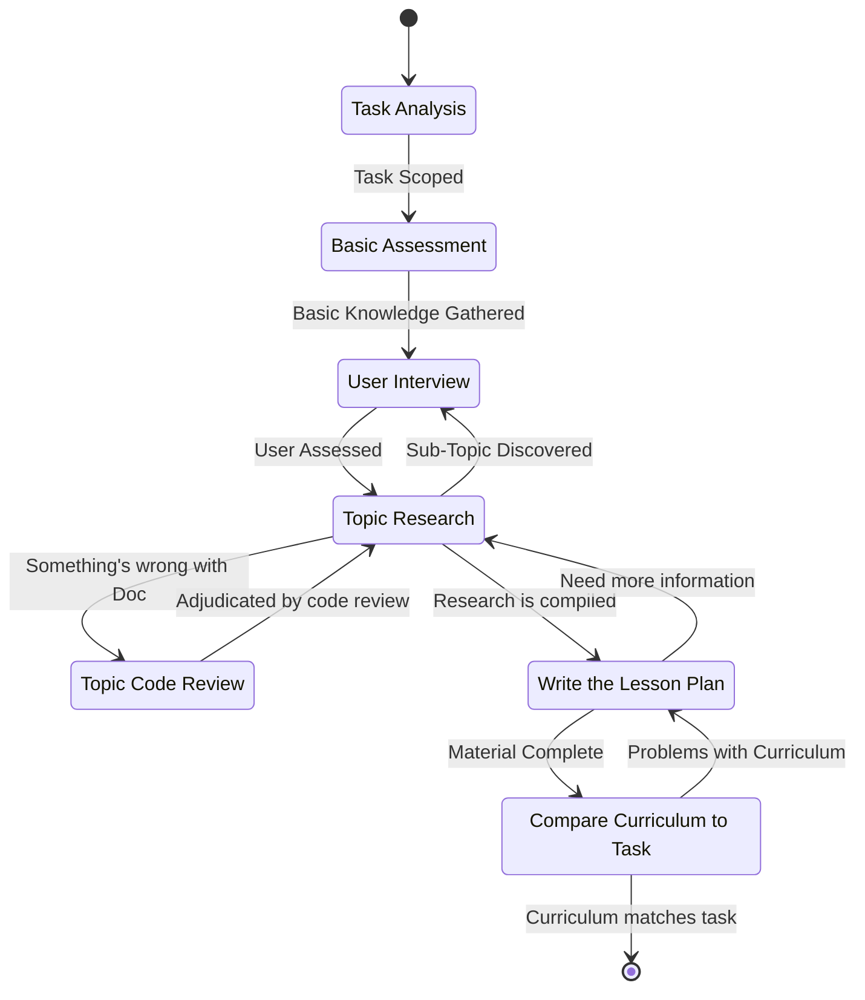

# Overall

This is a command to establish a learning plan to bridge the gap from what they know to what they don't. The learning plan will consist of documentation and an accompanying practical portion to complete for each lesson.

# The Process

The following Class diagram shows how each of the agents relate. 

Lines without arrows represent a persistent relationship — the same agent instance stays addressable across multiple rounds, the way a person has an ongoing conversation with the main agent rather than a single exchange. This implicitly means that the exchange between the main agent and the sub-agents is two-way.  Sub-agents should be allowed to pass questions and information among each other for clarification. 

Lines with a directional arrow indicate a one-shot subagent: the main agent spawns it, it completes a single task and reports its findings back, and that instance is not addressed again.

The process is diagrammed here in the following state chart:

## Rules for Main Agent

- Do not ever take the work of the-sub-agents and make any edits under any circumstances.  You're only job is to pass data from one sub-agent to another, or from the human user to a sub-agent.  Do not change anything, do not paraphrase, do not edit. If the sub-agent said it, then that's what they said. 
- You do not decide when things are done.  The sub-agent in charge of their task decides when they are done. 
- Rules for other tasks listed below must also be given to their sub-agents *verbatim*.
- When delegating a state to an agent, that state's description text from this document must be included verbatim in the agent's prompt.

# Steps In the Process
The following are the steps in the State Diagram.  Instructions below determine how they are to be followed. 

## Task Analysis
### Basics
- Performed by the main Agent.

### The Process

The main agent will establish what the user is trying to achieve. It might be something like:

- Being able to understand a codebase.
- Fixing a bug in an existing codebase.
- Building a new application from scratch.
- Using a similar but different tool in a codebase.
- Learning a new software tool.

The user will form their request as a prompt entered as a parameter to this command. If the user doesn't provide a prompt, ask them what they're looking to do. The user's goal is referred to as the **project**.

**First, determine the mode:**

- If the user references existing code (a repo, a file path, a specific bug, "help me understand/fix X"), this is **Discovery Mode**. Invoke the `discover-stack` skill.
- If the user describes a goal with no existing code ("I want to build X"), this is **Proposal Mode**. Invoke the `propose-stack` skill.
- If the request is ambiguous, ask the user directly which situation applies before proceeding.

Both skills produce the same output: a **Tech Stack List**, the set of subjects, concepts, Topics, and tools that make up the system, i.e. everything someone would need to know in order to work on it. 

### Output

The output of the initial assessment should be the **Tech Stack list.**  This is the list of subject/concept/topic/tools that are used in the project.  Each subject/concept/topic/tool should be listed, followed by a brief paragraph describing how that tool is used in the project. 

## Basic Assessment

### Basics
- Performed by the `simple-interviewer` Agent.

### Input
The Tech Stack List from the Task Analysis

### The Process

This is an informal assessment of the skill level on the tech stack of the learner. It's simply meant to establish the level of knowledge that the user feels they have about a subject. 

### Output

A basic assessment of the user's skillset, relative to what would be necessary to complete the objectives of the proposed work on the project. 

Therefore, the List is now each subject/concept/topic/tool, plus a paragraph about how much it is used in the project, and another paragraph about how much the user knows about the subject.

## User Interview

### Basics
- Performed by the `interviewer` Agent.

### Input
The Basic Assessment of the learner's skill-set.

### The Process

The purpose of the basic assessment was to determine roughly what the user knows about a subject. Now is the point to narrow that understanding with precision.

At this point, the user is interviewed to determine their knowledge of the various subjects/concepts/topics/tools. The interview shall be invoked iteratively: one question per call, with the main agent relaying that question to the user, then relaying the user's answer back to that same agent instance before requesting the next question. 

Since the basic assessment already covered some topics, the interview should account for this, which will expedite the interviewer process.  For instance, if the user explicitly said they know nothing about a certain subject/concept/topic/tool, it's probably not necessary to ask them about it.  

The main agent does not choose what to ask, interpret an answer, or decide when the interview ends — that authority belongs to the `interviewer` agent alone, which also produces the final determination itself, from having tracked the interview throughout, rather than the AI reconstructing it afterward.

The `interviewer` may, however, need to establish relevance of its questions to the project itself, and should be asking the main agent, who may forward questions to other agents, whether it's question has pertinence, so as to not ask questions that have no bearing on the project. 

### Output

This will be the same list as the list that was established by the basic assessment, but with significantly more precision, describing exactly which sub-topics of a subject/concept/topic/tool the user is familiar with, and where the gaps lie. The user's conceptual knowledge will be separate from their vocabulary knowldge.  This means that if a user knows how to do something, but doesn't know the terminology for it, this is considered different from actually not knowing the subject/concept/tool/topic.  From this, the interview can tell exactly what things the user must learn in orer to complete the work necessary to accomplish the objectives of the project.

## Topic Research

### Basics
- Performed by the `deep-researcher` Agent.

### Input
The Interview results with each subject/concept/topic/tool, and the user's knowledge of it. 

### The Process
Now the task is the research on each subject/concept/topic/tool to establish the curriculum of documentation that the user would need to get from their current state of knowledge, to the state of knowledge necessary to complete the work for the project.  The following are some of the place that the researcher could go in order to 

- Reading the online documentation on the component from the official website. 
- Reading the Forums or articles on the component. 

The research process will likely be recursive. eg: in order to know Postgres, you need to know SQL.  So the research can stop once it crosses into the knowledge base of the user.

It may be possible that the *Topic Research* process discovers further prerequisites to a given subject/concept/topic/tool.  This could be either a situation where a new prerequisite subject/concept/topic/tool is discovered, or there is simply more information about the subject/concept/topic/tool that wasn't assessed relative to the user's knowledge. In either case, it may be necessary to go back to the *User Interview* and ask more questions to the user. This loop-back shall resume the same `interviewer` agent instance used for the original interview, not spawn a new one — the agent needs the full history of prior answers to fold the new question into one coherent determination, rather than producing a second, disconnected assessment.

### Output
The list of Documentation that is necessary to get the user from their current state to the state in which they know enough to complete the task for the project. This will be referred to as the curriculum. The curriculum shall be in an order in which the human user is expected to read the material. This means that no subject shall contain material that has not been learned in a previous subject. 

## Write the Lesson Plan

### Basics

- Performed by the `tech-writer` Agent.

### Input

- The curriculum from the Research State.
- The interview assessmentof the user.

### The Process

This is where the lesson plan is actually created.  Everything from the curriculum must have a practical application to the project. 

Each section of the lesson shall contain two sub-sections:

1. The documentation that the user needs to read in order to be effective with that subject. If only a specific section of the 
2. A practical application of the lesson in the project itself.  This will tell the user where to practice what they have just learned, and how to apply it. The work should be pertinent to that section of the lesson and not be dependent on things that have not been learned yet. 

### Other Considerations

- Exercises should default toward open-ended framing. Rather than handing the learner a fully-specified function signature and skeleton body, prefer pointing at a real file and a real-world scenario and letting them work out the shape — e.g. "apply what you learned about `except ... as e` to `main.py`".
- Always tune a lession section to bridge the gap between the user's existing knowledge and what they do not know.  Sometimes that might be as simple as "here's the vocabulary for what you already know" or "here's the code to do what you already understand" or "here's a refresher on a concepy you were mostly good, but a little fuzzy on".  Some times it might be "you said you don't know anything about this subject, so let's start at the beginning".  Always tune approporaitely. 

### Output
The completed lesson plan for the user
## Compare Curriculum to Task

### Basics

- Performed by the `skeptical-student` Agent.

### Input

The lesson plan that was written.

### The Process

The task is to check the work of the lesson plan. They are looking to make sure that each section has both a documentation sub-section and a practical sub-section. 

There shall be a check of the documentation sub-section. They are checking for things that are ordered incorrectly, as in things that have pre-requisite knowledge out of order. Or things that are worded incorrectly.  

In addition, for every lesson, read the practical portion and consider the following:
- Does this apply the lessons learned from the documentation?
- Does this move the project forward?
- Is this appropriate to the user's knowledge level?

This agent has no shell or git access — if verifying sufficiency requires checking the user's own project source, that source must already be materialized as plain, readable files (see *Topic Code Review*) before this agent is invoked.

### Output

Final approval on the curriculum for the user to follow, or — if approval is withheld — a set of change-requests sent back to whoever owns the affected content. This can go through multiple iterations, but if everything was addressed after review, you should approve.  But don't let the writer get away with changing things that you didn't tell it to, and sneaking in new problems. 

## Topic Code Review

The *Topic Research* may find what the documentation says simply does not align with the actual functionality of the subject/concept/topic/tool, or that there are different docs out there that don't agree. In this case, we must look at the source code for whatever subject/concept/topic/tool is in question to determine the truth. If there's something we don't know about SQLAlchemy, for instance, maybe we have to look at the source for it.  This should be expected to be a very rare occurrence. 

In order to do this, first materialize the real source as plain files somewhere the agent can read them directly — for a third-party subject/concept/topic/tool, clone its repository to the home directory; for the user's own project, check out the correct branch into a worktree, since a mid-branch git ref is not something these agents can resolve themselves. Then have the `code-reader` agent read through it. Neither `code-reader` nor the `skeptical-student` agent used in *Compare Curriculum to Task* has shell or git access — both can only read files placed directly in front of them. Any state that needs either agent to check real source must complete this preparation first; neither agent can be told to "check the repo" and be expected to locate or check it out on its own.

This state is not limited to resolving items Topic Research explicitly flagged as uncertain. It must also spot-check any code claim baked into the User Interview questions or Topic Research findings against the actual source, regardless of whether anyone flagged it — a confidently stated claim is not evidence it was verified. This applies with equal weight to claims embedded in an applied portion — a file path, a command, a predicted output, or a described failure mode is exactly the kind of claim this state exists to verify, and getting one wrong is worse here than in a reading list, since the user acts on it directly.